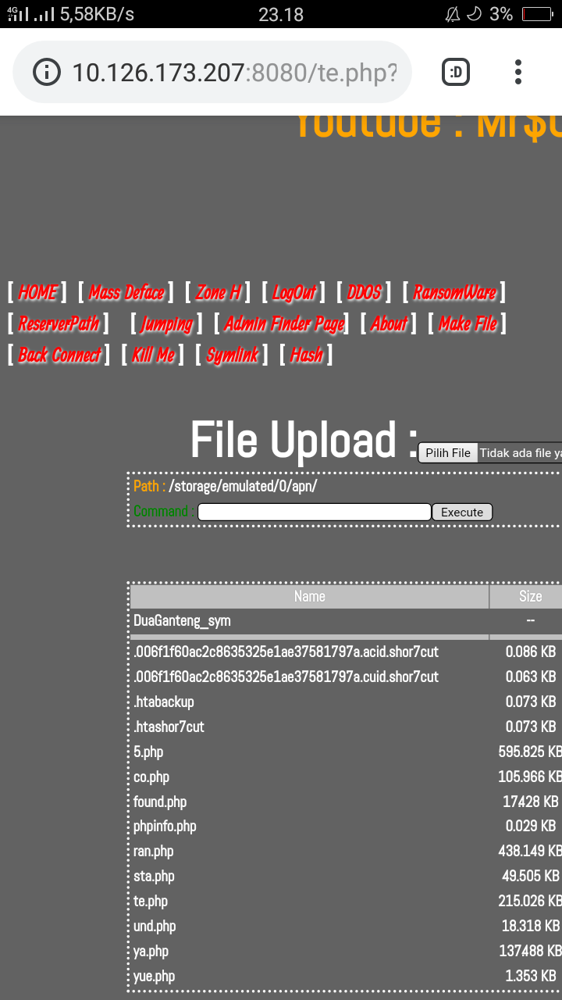

<br>
# minii
A simpel Basic php, html with css
```
- Username : TanahAir
- Password : Indonesia
- Hidden defalut : ?gans=burik
- example : www.site.com/s2.php?gans=burik
```
* fitur <br>
Home <br>
mass deface<br>
Admin Finder Page<br>
Zone-H<br>
Jumping<br>
DDOS/DoS<br>
Reservepath<br>
Ransomware (default punya author :v)<br>
Back Connect <br>
Symlink <br>
Generate hash <br>
Make File <br>
Kill Me <br>
About server <br>
